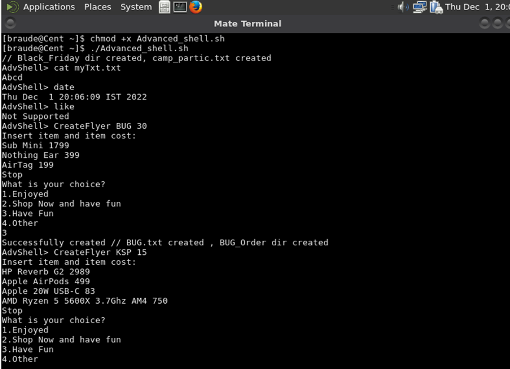
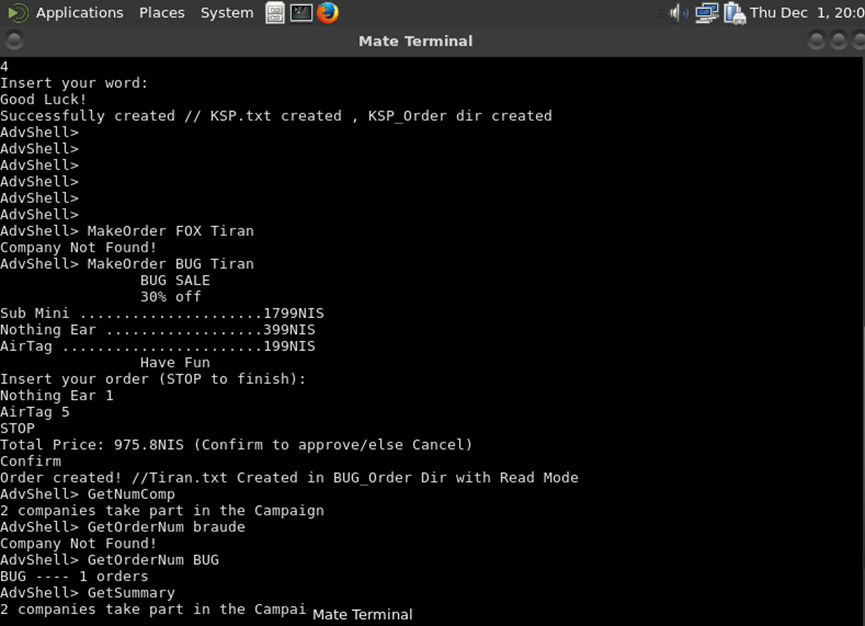

# 🛍️ Linux Black Friday Campaign Shell System

A university operating systems project implemented in C and Linux. The system simulates a Black Friday marketing campaign where companies can create flyers, customers can place orders, and campaign managers can track summaries — all via a custom-built command shell.

---

## 📂 Project Structure

| File                  | Description |
|-----------------------|-------------|
| `Advanced_Shell.c`    | Custom command-line shell that serves as the main interface. Supports up to 3 arguments per command. |
| `CreateFlyer.c`       | Allows a company to register for the campaign and generate a flyer (includes item names, prices, and custom message). |
| `MakeOrder.c`         | Enables customers to place orders from company flyers. Applies discounts, calculates totals, and writes order files. |
| `GetFlyer.c`          | Prints the flyer of a selected company. |
| `GetOrderNum.c`       | Counts and displays the number of orders a company received. |
| `GetSummary.c`        | Displays the number of participating companies and order statistics. |
| `GetNumComp.c`        | Displays how many companies are registered for the campaign. |
| `exit.c`              | Cleans up by removing the campaign directory and exiting. |
| `count.sh`            | Helper shell script that counts order files in a company folder. |

---

## 📦 How to Build

Use the provided script to compile everything:

```bash
chmod +x Advanced_shell.sh
./Advanced_shell.sh
```

This will compile all `.c` files and launch the `Advanced_Shell` interface.

---

## 🧪 How to Use

From the `AdvShell>` prompt, you can run:

- `CreateFlyer <CompanyName> <Discount>` – Register a company and create a flyer.
- `MakeOrder <CompanyName> <CustomerName>` – Place an order.
- `GetFlyer <CompanyName>` – Show the flyer.
- `GetOrderNum <CompanyName>` – Show number of orders.
- `GetSummary` – Show summary of all companies and their order counts.
- `exit` – Cleanup and exit the campaign.

Example session:
```
AdvShell> CreateFlyer Amazon 25
AdvShell> MakeOrder Amazon John
AdvShell> GetSummary
AdvShell> exit
```

---

## 🗂️ Filesystem Notes

All files are saved under:
```
/home/braude/Black_Friday/
```
Each company has a subfolder named:
```
<CompanyName>_Order/
```

---

## 🛠️ Technologies

- Language: C
- Platform: Linux
- System Calls: `fork`, `exec`, `read`, `write`, `open`, `mkdir`, `unlink`
- Scripting: Bash (for helper script)

---

## ✅ Features

- Manual string parsing (no `getline`/`split`)
- File I/O and permission control
- Dynamic command shell
- Real-time process creation and synchronization

---

## 📸 Screenshots / Sample Output



---

## 🔒 Permissions

Ensure you have write permissions to `/home/braude/Black_Friday` or change the path in the source code to a directory under your home.

---
