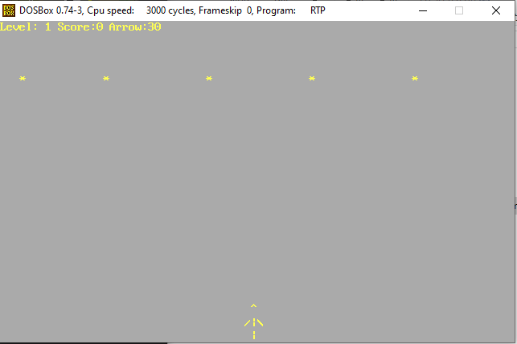
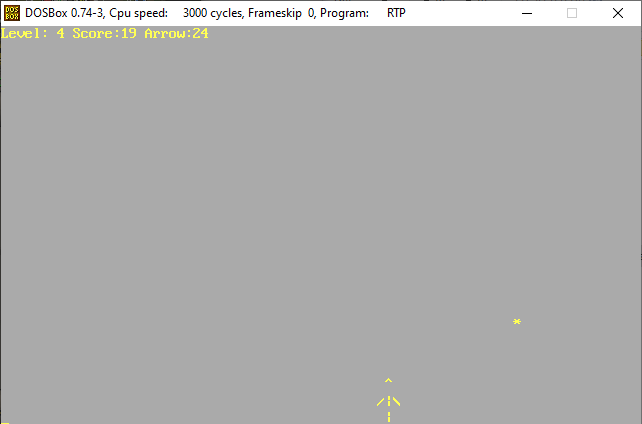
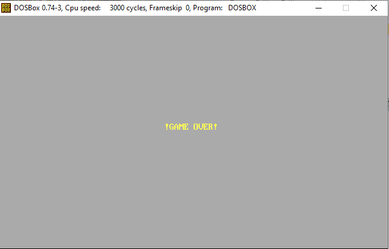

# 🎮 Real-Time Space Invaders Game Projects

This repository includes two versions of a Space Invaders–style shooting game, each developed as part of an academic course on Operating Systems and Real-Time Systems.

> 🏆 Both versions received a score of **100/100**.

---

## 🧵 Project Versions

### 🔹 Turbo C (TCC) Version

A real-time game built in **Turbo C** under **DOSBox**, using low-level hardware access and interrupt handling.

#### 💡 Technical Highlights:
- Direct keyboard input via **I/O ports (0x60/0x61)**
- Timer control via **INT 8** interrupt
- Display output using **text-mode memory segment 0xB800**
- Manual screen rendering, arrow mechanics, and collision detection
- Custom level system, scoring, and increasing difficulty

#### 🎯 Key Concepts:
- Real-time control loop
- Interrupt-driven input
- Memory-mapped video I/O
- Procedural game loop under tight CPU control

---

### 🔹 Xinu OS Version

A reimplementation of the game inside the **Xinu operating system**, showcasing process-based multitasking and interrupt service routines within an OS kernel.

#### 💡 Technical Highlights:
- Uses Xinu **processes (`create`, `resume`)** for concurrent tasks: input, display, update
- Keyboard ISR (INT 9) installed via **modification of `sys_imp`**
- Custom **`schedule()` system call** manages process timing in a round-robin-like fashion
- Message passing using **`send`/`receive`**
- Realtime updates and scheduling controlled by `sleept()`

#### 🧠 Operating Systems Concepts Demonstrated:
- User-defined ISRs
- Cooperative multitasking
- Message-based synchronization
- Custom system calls
- Real-time task coordination inside an OS

---

## 📚 Purpose

Both projects were developed to apply core concepts from:
- Real-Time Computing
- Operating Systems Design
- Interrupt handling
- Low-level programming and scheduling

They serve as working demonstrations of what happens **below the abstraction layers** in modern systems.

---

## 📸 Screenshots / Sample Output

---

## 📄 Note

Some files (like `kernel/` or `conf.h`) in the Xinu version are part of academic distributions and should be used only for educational and non-commercial purposes. Respect license and institutional policies.

---